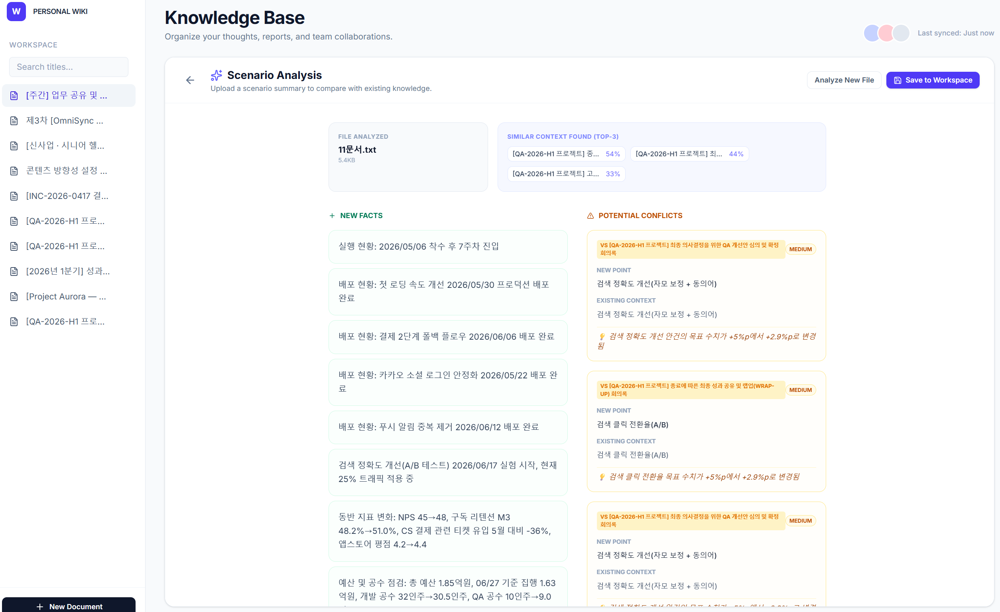

# Wiki Workspace

> **English version:** [README.md](README.md)



로컬 우선(local-first) 마크다운 위키 + AI 기반 문서 delta(새 정보·충돌) 추출.

- **Zero-setup** — 첫 실행 시 샘플 문서 10건이 시드되고, 전부 `localStorage` 에 영속. 로그인도 서버도 없이 즉시 동작.
- **Edit / Split / Preview** 3-모드 마크다운 에디터 (CommonMark + GFM), 300ms debounce 자동 저장.
- **AI docdelta** — `.txt` 를 업로드하면 순수 JS TF-IDF 로 워크스페이스 Top-3 유사 문서를 자동 선정하고, 모델이 기존 문서 대비 **new**(새 정보)와 **conflict**(충돌) 를 추출.
- **AI 백엔드 3종 공존**: `mock`(결정론적 synthetic), `finetuned`(임의 HTTP 엔드포인트), **`vllm`**(OpenAI-호환 vLLM 서버 + `guided_json`).

## 데모


<video src="https://github.com/kwkim1991/semantic-diff-extraction/raw/main/docs/assets/quokka_record.mp4" controls width="720"></video>

## 빠른 시작

### 사전 요구사항
- Node 20+ (v12 는 Vite 6 실행 불가 — `nvm install 24` 권장)
- Python 3.11+ with [uv](https://github.com/astral-sh/uv) (또는 `pip`)

### 실행 (mock 모드 — 기본, LLM 불필요)

```bash
# 1) 백엔드 (FastAPI :3001)
cd backend
uv sync
uv run uvicorn app.main:app --port 3001

# 2) 프론트엔드 (Vite :3000, /api → :3001 프록시)
cd ../frontend
npm ci
npm run dev
```

http://localhost:3000 을 열면 첫 실행 시 샘플 문서 10건이 시드되고, 에디터는 기본 **Preview** 모드로 뜨며 AnalyzePanel 이 업로드를 받을 준비가 된 상태입니다.

### 실제 vLLM 모델과 연결

```bash
# 무거운 extras 최초 1회 설치
cd backend && uv sync --extra vllm

# vLLM 모드로 백엔드 기동 (vLLM 이 :9983 에 이미 떠 있다고 가정)
LLM_PROVIDER=vllm VLLM_ENDPOINT=http://localhost:9983/v1 \
  uv run uvicorn app.main:app --port 3001
```

전체 env 매트릭스(finetuned provider, tokenizer override, timeout 등)는 [ARCHITECTURE.md §8.2](ARCHITECTURE.md#82-env-매트릭스) 참조.

## 디렉토리 구조

```
frontend/    React 19 + Vite 6 + Tailwind 4 SPA
backend/     FastAPI + Pydantic v2 (Phase 2+)
docs/        설계 문서 9편 (권위 출처)
reference/   doc_scheme.json (AI 계약 단일 SoT)
train/       학습 코드 (backend/_vendor/ 로 벤더링, 수정 금지)
.claude/     에이전트 하네스 (6 agents + 7 skills)
```

## 문서

| 진입점 | 용도 |
|---|---|
| [ARCHITECTURE.md](ARCHITECTURE.md) | 5분 안에 프로젝트 지형 파악 |
| [docs/01_overview.md](docs/01_overview.md) | 제품 비전·사용 시나리오 |
| [docs/02_architecture.md](docs/02_architecture.md) | 레이어 설계·데이터 흐름 |
| [docs/04_api.md](docs/04_api.md) | API 계약·에러 envelope |
| [docs/05_data_schema.md](docs/05_data_schema.md) | `Document` 타입·스토리지 스키마 |
| [docs/07_roadmap.md](docs/07_roadmap.md) | Phase 0→4 로드맵 |
| [docs/08_tradeoffs.md](docs/08_tradeoffs.md) | T1~T12 의사결정·번복 이력 |

## 불변 규칙 (어떤 Phase 에서도 위반 금지)

- **R1 데이터 이동성** — 언제든 `.md` 로 export 가능해야 한다.
- **R2 로컬 우선** — 네트워크·백엔드 없어도 앱이 동작해야 한다.
- **R3 마크다운 원문 보관** — 서버 어디서도 렌더된 HTML 만 저장하지 않는다.
- **R4 하위 호환 `Document`** — 필드는 추가만, 제거·변경 금지.

상세: [`ARCHITECTURE.md §5`](ARCHITECTURE.md#5-4대-불변-규칙-모든-phase-교차-적용).

## 현재 상태

Phase 2a (AI 서버 프록시 + provider 3종) 완료. Phase 2b 클라이언트 흐름(업로드 + TF-IDF Top-3 + AnalyzePanel)도 end-to-end 로 동작. Phase 3(클라우드 동기화)·Phase 4(협업) 미진입.

## 라이선스

미정.
